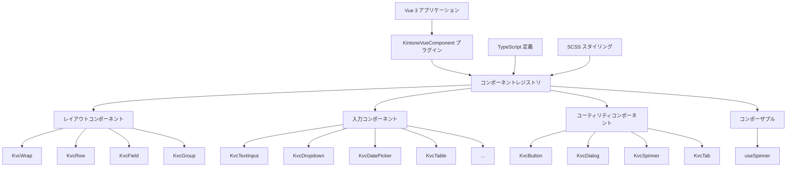

# 設計文書

## 概要

kintone Vue3 コンポーネントライブラリは、kintone カスタマイズと業務アプリケーション開発に特化して設計された包括的な UI コンポーネントセットを提供する、モジュラーで TypeScript ファーストなコンポーネントライブラリとして設計されています。このライブラリは Vue 3 の Composition API パターンに従い、kintone のネイティブフィールドタイプとデザインシステムとのシームレスな統合を提供します。

## アーキテクチャ

### 高レベルアーキテクチャ



### コンポーネント階層と依存関係

ライブラリは以下の厳密な階層構造に従います：

1. **KvcWrap** がルートコンテナ（form または div）として機能
2. **KvcRow** が KvcWrap 内で水平レイアウトを提供
3. **KvcField** がラベルとバリデーションを持つ個別フォームフィールドをラップ
4. **入力コンポーネント** が適切なスタイリングと動作のために KvcField 内に配置

### プラグインアーキテクチャ

ライブラリはグローバル登録のために Vue 3 のプラグインパターンを実装します：

```typescript
const KintoneVueComponent: Plugin = {
  install(app: App) {
    Object.entries(components).forEach(([componentName, component]) => {
      app.component(vueComponent.name || componentName, vueComponent)
    })
  }
}
```

## コンポーネントとインターフェース

### レイアウトコンポーネント

#### KvcWrap
- **目的**: `<form>` または `<div>` としてレンダリングできるルートコンテナ
- **主要機能**: 
  - フォーム送信処理
  - グローバルスタイリングコンテキスト
  - イベント委譲
- **Props**: `isForm?: boolean`

#### KvcRow
- **目的**: フォーム行の水平レイアウトコンテナ
- **主要機能**:
  - レスポンシブレイアウト
  - 一貫したスペーシング
  - Flex ベースの配置

#### KvcField
- **目的**: ラベル、バリデーション、エラー表示を持つフィールドラッパー
- **主要機能**:
  - 必須フィールド表示
  - エラーメッセージ表示
  - 成功メッセージ表示
  - 柔軟な幅制御
- **Props**: `required?, width?, errorMessage?, successMessage?`

#### KvcGroup
- **目的**: 折りたたみ可能なグループ化コンテナ
- **主要機能**:
  - 折りたたみ/展開動作
  - カスタムラベル
  - ネストしたコンテンツサポート
- **Props**: `label?, open?, collapsible?, width?`

### 入力コンポーネント

#### テキスト入力コンポーネント
- **KvcTextInput**: タイプバリエーション（text、email、number、password）を持つ単一行テキスト
- **KvcTextarea**: 複数行テキスト入力

**共通機能**:
- v-model による双方向データバインディング
- 読み取り専用と無効状態
- カスタム幅サポート
- プレースホルダーテキスト
- バリデーション属性（数値の min、max）

#### 選択コンポーネント
- **KvcDropdown**: 単一選択ドロップダウン
- **KvcRadio**: 単一選択ラジオボタン
- **KvcCheckbox**: 複数選択チェックボックス
- **KvcMultiSelect**: 複数選択リスト
- **KvcAutocomplete**: オートコンプリート付き検索可能単一選択

**共通機能**:
- 柔軟なアイテム構造（文字列、数値、または label/value を持つオブジェクト）
- カスタムラベルと値キーマッピング
- 無効アイテムサポート
- 読み取り専用表示モード

#### 日付/時刻コンポーネント
- **KvcDatePicker**: 日付選択
- **KvcTimePicker**: 時刻選択
- **KvcDateTimePicker**: 日付と時刻の組み合わせ選択

**共通機能**:
- 日付操作のための dayjs との統合
- ローカライゼーションサポート
- 読み取り専用と無効状態
- カスタム日付フォーマット処理

#### 高度なコンポーネント

##### KvcTable
- **目的**: 行の追加/削除とドラッグアンドドロップを持つ動的テーブル
- **主要機能**:
  - 動的行管理
  - ドラッグアンドドロップによるソート可能な行
  - カスタム列定義
  - レコード URL リンク
  - 最小/最大行制約
- **統合**: `sortablejs` と `vue-draggable-next` を使用

##### KvcFileSelect
- **目的**: kintone 統合を持つファイル選択とアップロード
- **主要機能**:
  - 複数ファイル選択
  - ファイルタイプ制限
  - 自動アップロード機能
  - ファイルメタデータ処理
  - kintone ファイル API との統合

### ユーティリティコンポーネント

#### KvcButton
- **目的**: 複数バリアントを持つスタイル付きボタン
- **機能**:
  - カラーバリアント（normal、success、save、error）
  - サイズバリアント（normal、small）
  - スロットベースのコンテンツ

#### KvcDialog
- **目的**: カスタマイズ可能なコンテンツとアクションを持つモーダルダイアログ
- **機能**:
  - アイコンタイプ（info、warning、error、success、question）
  - カスタマイズ可能なボタン
  - ボディスクロールロック
  - イベント発行（cancel、confirm、close）

#### KvcTab システム
- **KvcTab**: ナビゲーション付きタブコンテナ
- **KvcTabPane**: 個別タブコンテンツ
- **機能**:
  - アクティブタブ管理
  - カスタムサイジング
  - スロットベースのコンテンツ

#### KvcSpinner
- **目的**: ローディングインジケーターコンポーネント
- **統合**: グローバル状態管理のための useSpinner コンポーザブルと連携

## データモデル

### コアインターフェース

#### KvcItemBase
```typescript
interface KvcItemBase {
  label?: string;
  value?: string | number;
  disabled?: boolean;
  [key: string]: any;
}
```

#### コンポーネント Props パターン
すべてのコンポーネントは一貫した props パターンに従います：
- `modelValue`: 双方向バインディング用
- `readOnly?: boolean`: 読み取り専用表示用
- `disabled?: boolean`: 無効状態用
- `nonstyled?: boolean`: カスタムスタイリングオーバーライド用
- `width?: string | number`: カスタム幅制御用

#### ファイルデータ構造
```typescript
interface KvcFileData {
  fileKey?: string;
  name: string;
  size: number;
  contentType?: string;
  data?: ArrayBuffer;
}
```

#### テーブル構造
```typescript
interface KvcTableColumn {
  code?: string;
  label?: string;
  width?: string | number;
  [key: string]: any;
}

interface KvcTableRowMeta {
  code: string;
  key: string;
}
```

## エラーハンドリング

### バリデーション戦略
1. **Props バリデーション**: TypeScript インターフェースがコンパイル時バリデーションを提供
2. **ランタイムバリデーション**: コンポーネントが props を検証し適切な警告を発行
3. **ユーザー入力バリデーション**: コンポーネントがエラーメッセージを通じてバリデーションフィードバックを提供
4. **状態管理**: すべてのコンポーネント間で一貫したエラー状態処理

### エラー表示パターン
- **フィールドレベルエラー**: KvcField の errorMessage prop を通じて表示
- **フォームレベルエラー**: 親コンポーネントで処理
- **システムエラー**: 開発デバッグ用のコンソール警告

### アクセシビリティエラーハンドリング
- エラー状態の ARIA ラベル
- バリデーション変更のスクリーンリーダーアナウンス
- エラー状態中のキーボードナビゲーション保持

## テスト戦略

### ユニットテストアプローチ
1. **コンポーネント分離**: モック依存関係を使用して各コンポーネントを分離してテスト
2. **Props テスト**: すべての props の組み合わせとエッジケースを検証
3. **イベントテスト**: 適切なイベント発行と処理を保証
4. **アクセシビリティテスト**: ARIA 属性とキーボードナビゲーションを検証

### 統合テスト
1. **コンポーネント構成**: コンポーネント階層をテスト（KvcWrap → KvcRow → KvcField → Input）
2. **プラグインインストール**: グローバルコンポーネント登録を検証
3. **TypeScript 統合**: 実世界の使用シナリオでの型安全性を保証

### テスト構造
```
test/
├── components/
│   ├── layout/
│   │   ├── KvcWrap.test.ts
│   │   ├── KvcRow.test.ts
│   │   └── KvcField.test.ts
│   ├── input/
│   │   ├── KvcTextInput.test.ts
│   │   ├── KvcDropdown.test.ts
│   │   └── ...
│   └── utility/
│       ├── KvcButton.test.ts
│       ├── KvcDialog.test.ts
│       └── ...
├── composables/
│   └── useSpinner.test.ts
└── integration/
    ├── plugin.test.ts
    └── component-hierarchy.test.ts
```

### パフォーマンステスト
1. **バンドルサイズ**: コンポーネントツリーシェイキング効果を監視
2. **レンダリングパフォーマンス**: 大きなデータセットでテスト（特に KvcTable）
3. **メモリ使用量**: イベントリスナーとウォッチャーの適切なクリーンアップを保証

## スタイリングアーキテクチャ

### SCSS 構造
```
src/scss/
├── _variables.scss      # デザイントークンとテーマ変数
├── _mixins.scss         # 再利用可能なスタイリングミックスイン
├── _base.scss           # ベーススタイルとリセット
├── components/
│   ├── _layout.scss     # レイアウトコンポーネントスタイル
│   ├── _input.scss      # 入力コンポーネントスタイル
│   └── _utility.scss    # ユーティリティコンポーネントスタイル
└── themes/
    ├── _kintone.scss    # kintone 固有テーマ
    └── _custom.scss     # カスタムテーマオーバーライド
```

### CSS クラス命名規則
- **コンポーネントプレフィックス**: すべてのクラスに `kvc-` プレフィックス
- **BEM 方法論**: Block__Element--Modifier パターン
- **状態クラス**: 一貫した状態命名（disabled、readonly、error、success）

### テーマカスタマイゼーション
- 簡単なテーマ設定のための CSS カスタムプロパティ
- ビルド時カスタマイゼーションのための SCSS 変数
- `nonstyled` prop によるコンポーネントレベルスタイルオーバーライド

## ビルドと配布

### ビルドパイプライン
1. **TypeScript コンパイル**: 型定義を生成
2. **Vue SFC コンパイル**: 単一ファイルコンポーネントを処理
3. **SCSS 処理**: スタイルシートをコンパイルし最適化
4. **バンドル生成**: ES モジュールと UMD ビルドを作成
5. **ツリーシェイキング最適化**: 個別コンポーネントインポートが動作することを保証

### 配布フォーマット
- **ES モジュール**: ツリーシェイキング付きモダンバンドラー用
- **UMD**: 直接ブラウザ使用用
- **TypeScript 定義**: 開発時型チェック用
- **CSS バンドル**: 柔軟な統合のための別個スタイルシート

### パッケージ構造
```
dist/
├── kintone-vue3-component.es.js    # ES モジュールビルド
├── kintone-vue3-component.umd.js   # UMD ビルド
├── kintone-vue3-component.css      # コンパイル済みスタイル
├── index.d.ts                      # 型定義
└── components/                     # 個別コンポーネントビルド
    ├── KvcButton.js
    ├── KvcTextInput.js
    └── ...
```